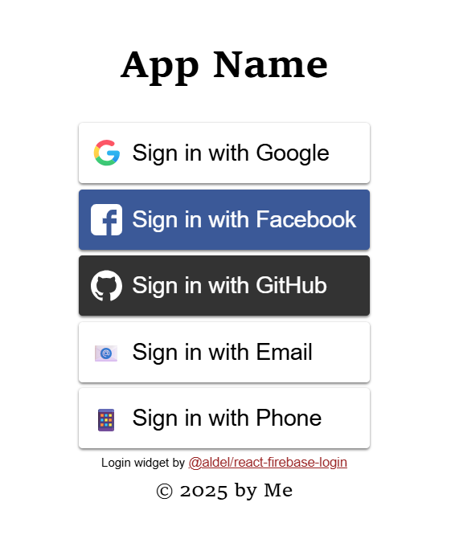

# react-firebase-login

This package provides a React component that makes it extremely simple to do [Firebase Authentication](https://firebase.google.com/docs/auth) sign-in for your React web app.

To install:

```
npm install @aldel/react-firebase-login
```

To use, in its simplest form, import the [FirebaseLogin](functions/FirebaseLogin.html) component and wrap your app's components in it:

```tsx
import { initializeApp } from "firebase/app";
import { FirebaseLogin } from '@aldel/react-firebase-login';
import { firebaseConfig } from './firebaseConfig';

initializeApp(firebaseConfig);

function App() {
  return (
    <FirebaseLogin>
      Ok, you are logged in!
    </FirebaseLogin>
  );
}

export default App;
```

That shows a "Sign in with Google" button when the user is not logged in, and "Ok, you are logged in!" when they are.

Here's a more complete example:

```tsx
import { initializeApp } from "firebase/app";
import { LogoutButton, FirebaseLogin, useAuth, fullPageFrame } from '@aldel/react-firebase-login';
import { firebaseConfig } from './firebaseConfig';

initializeApp(firebaseConfig);

function InnerContent() {
  const { user } = useAuth();
  return (
    <div>
      <p>
        Logged in as { user.email || user.phoneNumber || '(No email or phone)' }
      </p>
      <LogoutButton />
    </div>
  );
}

function App() {
  return (
    <FirebaseLogin
      methods={['google', 'facebook', 'github', 'email', 'phone']}
      redirect
      header={<h1>App Name</h1>}
      footer="© 2025 by Me"
      frame={fullPageFrame}
    >
      <InnerContent />
    </FirebaseLogin>
  );
}

export default App;
```

This adds:
* When not signed in:
    * 5 different "Sign in with" buttons for different methods (default is just Google)
    * Uses `signInWithRedirect` instead of `signInWithPopup` (the default) for Google, Facebook, and GitHub (more error-prone; see below)
    * Header and footer elements for the sign-in UI
    * A "frame" that centers the sign-in UI in the browser window
* When signed in, displays:
    * The user's email (or phone number if they used phone login)
    * A sign out button

It looks something like this:



For many applications, the above is probably everything you need.

## Sign-in methods

The supported methods are shown [here](types/LoginMethodName.html). You must enable and properly configure each method you are using in the Firebase console.

If the methods list only has one method and it's `"email"`, `"email_link"`, or `"phone"`, the initial list of "Sign in with ..." buttons is not shown; it immediately shows the UI for the specified method.

Some methods support their own individual options. If not using the default options, instead of including just the method name, you can put it in its own 2-member array, with the options as the second member, i.e. `methods=[["google", googleOptions], ...]`. Method options are described below in the sections for each method.

#### Hosting

Some methods assume that your app is running on [Firebase Hosting](https://firebase.google.com/docs/hosting), which automatically provides support for Firebase Authentication on a few special URL paths that start with `__/`. These are generally for things like email verification links, password reset links, and redirect URLs. If hosting your app somewhere else (including, probably, [Firebase App Hosting](https://firebase.google.com/docs/app-hosting)), you can probably get away without the special URLs if you (a) don't use `"email"` or `"email_link"` methods, (b) use popup instead of redirect for any SSO login methods, and (c) set `requireVerification={false}`. Otherwise you may need to jump through [additional hoops](https://firebase.google.com/docs/auth/web/redirect-best-practices).

### Email verification

By default, the user's email needs to be verified before they are considered to be signed in. Some SSO methods automatically provide verification, but some may not. The `"email_link"` method automatically verifies the email by its very nature; `"email"` does not. The `"phone"` method does not require email verification even if verification is turned on.

If email verification is required, `FirebaseLogin` will send a verification
email and tell the user to open it and click on the link. They can also click a
button to re-send the email, or another button to cancel the login.

Under the Firebase emulator, the link is printed to the console instead of being emailed.

To disable the email verification requirement, set `requireVerification={false}` in the `FirebaseLogin` props.

### SSO (OAuth) methods

The SSO options are fairly obviously named; `"twitter"` is used instead of `"x"`.

By default, these methods use `signInWithPopup` to show a popup window. To use `signInWithRedirect` instead, set the `redirect` boolean prop in `FirebaseLogin`.

Note that `signInWithRedirect` is somewhat error-prone. Make sure you follow [best practices for redirect](https://firebase.google.com/docs/auth/web/redirect-best-practices), and be aware that it [won't work locally without the emulator](https://github.com/firebase/firebase-js-sdk/issues/7342).

#### OAuth scopes

To request additional OAuth scopes for a given SSO method, use method options:

```tsx
methods=[
  [
    "google",
    { scopes: ["scope1", "scope2"]},
  ],
]
```

### Email and password

To allow sign-in with email and password, use the `"email"` method. This is only intended for use when you have NOT enabled "Email link (passwordless login)" in the Firebase console.

You can't use both `"email"` and `"email_link"` because they are the same "provider" in Firebase Authentication with different configuration.

### Email link

If "Email link (passwordless login)" is enabled in the Firebase console, use `"email_link"` instead of `"email"`.

Under the Firebase emulator, the link is printed to the console instead of being emailed.

### Phone

Phone login sends a confirmation code to the given phone number and waits for the user to enter it.

Phone authentication [uses Google's ReCAPTCHA in "invisible" mode](https://firebase.google.com/docs/auth/web/phone-auth#use-invisible-recaptcha). This attempts to determine that the user is probably human without popping up an actual CAPTCHA, but sometimes it will not be sure, and will show a ReCAPTCHA that the user must solve before it will send the confirmation text.

Note that phone login with real phone numbers [may not work when running locally on "localhost"](https://www.reddit.com/r/Firebase/comments/1e8pdcf/firebase_error_authinvalidappcredentials_in/). You can set up fake phone numbers for testing in the Firebase console; or you can use the Firebase Emulator to emulate authentication, in which case the confirmation code will be printed out by the emulator instead of sent via text.

#### Alternate phone number input (recommended)

By default, the phone login UI uses the browser's native `<input>` element with `type='tel'`, and it requires that the user enter their country code (`+1` for the USA). This is not a very good UI. You can provide a different UI in the method options:

```tsx
methods=[
  [
    "phone",
    { inputComponent: PhoneInputComponent },
  ],
]
```

The component you provide must implement [these props](types/PhoneInputComponentProps.html) and display any instructions needed. This is not difficult to do yourself, but the best choice is usually to use [@aldel/react-firebase-login-phone-input](https://github.com/adelespinasse/react-firebase-login-phone-input), which is a wrapper around [react-phone-number-input](https://www.npmjs.com/package/react-phone-number-input). This displays a pulldown list for the user's country, which defaults to the default locale in their browser, and formats the number appropriately as they type it.

To use it you must include the `react-phone-number-input` style sheet, which is re-exported by the wrapper component. A complete example looks like this:

```tsx
import { initializeApp } from 'firebase/app';
import { FirebaseLogin, useAuth, LogoutButton } from '@aldel/react-firebase-login';
import PhoneLogin from '@aldel/react-firebase-login-phone-input';
import '@aldel/react-firebase-login-phone-input/style.css';

import { firebaseConfig } from './firebaseConfig';
import './App.css'

initializeApp(firebaseConfig);

function LoggedIn() {
  const { user } = useAuth();
  return (
    <div>
      <h2>Logged in as { user.phoneNumber }</h2>
      <LogoutButton />
    </div>
  );
}

function App() {

  return (
    <>
      <FirebaseLogin
        methods={[['phone', { inputComponent: PhoneLogin }]]}
        header="@aldel/react-firebase-login-phone-input demo"
      >
        <LoggedIn />
      </FirebaseLogin>
    </>
  )
}

export default App
```

This would have been included as the default in `FirebaseLogin`, except that it seemed like excessive bloat for apps that don't use phone login (tree shaking [does not currently take care of that](https://github.com/adelespinasse/react-firebase-login/issues/26).)

## Accessing user info

The [getAuth](functions/useAuth.html) hook provides access to authentication state, like this:

```tsx
  const { auth, user, claims, signIn } = useAuth();
```

* `auth`: The Firebase [Auth](https://firebase.google.com/docs/reference/js/auth.auth) object used by `FirebaseLogin`.
* `user`: The Firebase [User](https://firebase.google.com/docs/reference/js/auth.user) object. This is guaranteed to always be valid, because the hook can only be used inside a `FirebaseLogin` component, which ensures that its children are not rendered unless there is an authenticated user. (If `getAuth` is used outside of the `FirebaseLogin` component, it will throw an exception.)
* `claims`: The user's claims, including [custom claims](https://firebase.google.com/docs/auth/admin/custom-claims) and standard JWT claims.
* `signIn`: A function that re-opens the sign-in UI to let the user sign in to a different account or link to a different sign-in provider. This accepts an optional boolean argument, `link`. If `link` is true, Firebase Auth will attempt to [link the new provider account to the currently signed in user account](https://firebase.google.com/docs/auth/web/account-linking). **This will fail if the provider account or credentials are already linked to a different Firebase Auth user.** If `link` is false or not provided, the user is simply signed into a different user account.

## Anonymous authentication

[Anonymous authentication](https://firebase.google.com/docs/auth/web/anonymous-auth) is not specified as a method in the `methods` prop. Instead, you can enable it with the `allowAnonymous` boolean prop. This fundamentally changes the behavior of the `FirebaseLogin` component: if the user is not signed in using another method, they are signed in anonymously, and the component's children are rendered, not the login UI. You can still allow them to log in by calling the `signIn` function returned by [getAuth](functions/useAuth.html). This calls up the login UI, with a "dismiss" button in the upper right. If you pass `true` as an argument to `signIn`, Firebase Auth will attempt to convert the anonymous user account to a named one. **This will fail if the SS provider account or credentials are already linked to a different Firebase Auth user.** Otherwise, the user will just be signed in with the credentials they provide, and the anonymous account will be dropped.

Linking is not especially recommended, because of the following problematic sequence of events:
1. The user is not signed in, so they are assigned an anonymous account.
2. The user signs in; the anonymous account is upgraded to a named account.
3. They sign out (or open your app on a different device); a new anonymous account is created.
4. They attempt to sign in with the same credentials; now they get an error because that account already exists.

This is difficult to work around. If data belonging to the anonymous account needs to be available to the upgraded account, it is better to create a new account and move the data into that account.

## LogoutButton

The [LogoutButton](functions/LogoutButton.html) component is provided as a convenience; you do not need to use it to sign out. You can instead get the `Auth` object from the [getAuth](functions/useAuth.html) hook and call `auth.signOut()`.

## Styling

Very minimal layout styling is hard-wired into the component as `style` props. It will normally use the default font, button styles, link styles, etc. To customize styles, you can provide CSS rules for various classes used in the component, all of which start with the prefix `react-firebase-login-`. The best thing to do is start using the component in your app, then inspect the DOM to see what classes you want to update. But for a simple example, to specify the style of all buttons in the `FirebaseLogin` component (except the top-level "Sign in with..." buttons) without affecting other buttons, you would do something like this:

```css
.react-firebase-login-container Button {
  color: #fff;
  background-color: #000;
  padding: 8px;
  cursor: pointer;
};
```

#### react-social-login-buttons

The top level "Sign in with..." buttons are provided by
[react-social-login-buttons](https://www.npmjs.com/package/react-social-login-buttons).
You can pass additional props to them with the `socialLoginButtonProps` prop of
`FirebaseLogin`.
